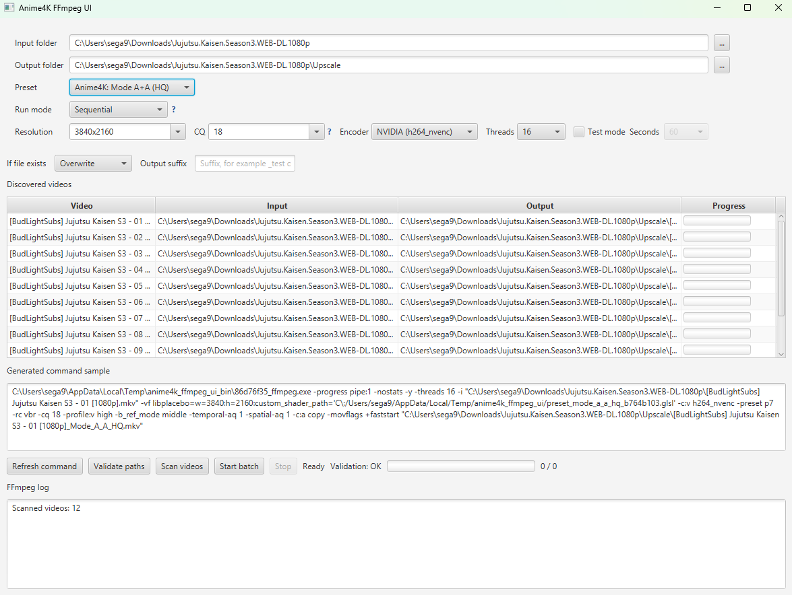

# Anime4K Video Converter

Windows GUI for batch video processing with Anime4K shaders and FFmpeg.

The application scans a folder of videos, builds a shader pipeline from bundled Anime4K presets, and runs FFmpeg jobs with progress tracking in a JavaFX desktop UI.



## Versions

### Full

- Includes bundled `ffmpeg` and `ffprobe`.
- Intended for end users who want a self-contained portable package.
- Output package: `dist-package/Anime4KVideoApp/`

### Lite

- Does **not** include bundled `ffmpeg` or `ffprobe`.
- Requires both commands to be available in `PATH`.
- Intended for smaller redistribution or users who already manage their own FFmpeg install.
- Output package: `dist-package-lite/Anime4KVideoAppLite/`

## Requirements

### Runtime

- Windows
- FFmpeg build with `libplacebo`
- One of the supported H.264 encoders:
  - `h264_nvenc` for NVIDIA
  - `h264_amf` for AMD
  - `h264_qsv` for Intel
  - `libx264` for CPU-only fallback
- For Lite: `ffmpeg` and `ffprobe` available in `PATH`

### Build

- JDK with `jpackage`
- Maven Wrapper is included

## Build Commands

### Standard JAR build

```powershell
.\mvnw.cmd clean package
```

### Run from source

```powershell
.\mvnw.cmd javafx:run
```

### Portable Full EXE bundle

```powershell
.\mvnw.cmd -Pportable-package clean package
```

Result:

- `dist-package/Anime4KVideoApp/Anime4KVideoApp.exe`
- ZIP release asset: `.\mvnw.cmd -Pportable-package-zip clean package`

### Portable Lite EXE bundle

```powershell
.\mvnw.cmd -Pportable-lite-package clean package
```

Result:

- `dist-package-lite/Anime4KVideoAppLite/Anime4KVideoAppLite.exe`
- ZIP release asset: `.\mvnw.cmd -Pportable-lite-package-zip clean package`

## Downloads

Current release:

- Release page: https://github.com/Sega5823/Anime4KVideoApp/releases/tag/v1.0.0
- Full portable ZIP: https://github.com/Sega5823/Anime4KVideoApp/releases/download/v1.0.0/Anime4KVideoApp-full-portable.zip
- Lite portable ZIP: https://github.com/Sega5823/Anime4KVideoApp/releases/download/v1.0.0/Anime4KVideoApp-lite-portable.zip

For GitHub Releases, publish portable archives instead of a standalone `.exe`.

Recommended release assets:

- Full: archive of `dist-package/Anime4KVideoApp/`
- Lite: archive of `dist-package-lite/Anime4KVideoAppLite/`

Auto-generated ZIP assets are written to:

- `release-assets/Anime4KVideoApp-full-portable.zip`
- `release-assets/Anime4KVideoApp-lite-portable.zip`

Suggested labels:

- `Anime4KVideoApp-full-portable.zip`
- `Anime4KVideoApp-lite-portable.zip`

## Usage

1. Start the application from the portable package folder.
2. Select input and output folders.
3. Choose a preset, encoder, and output settings.
4. Scan videos.
5. Start batch processing.

If an input folder is already saved in settings, the application will auto-scan it on startup.

## Distribution Notes

### Portable packages

Do not distribute only the `.exe` file.

Distribute the whole application folder:

- Full: `dist-package/Anime4KVideoApp/`
- Lite: `dist-package-lite/Anime4KVideoAppLite/`

Each package contains:

- launcher `.exe`
- `app/`
- `runtime/`

### Full vs Lite

Use Full if you want the simplest end-user experience.

Use Lite if you want a smaller package and are comfortable requiring a system FFmpeg installation.

## Third-Party Components

- FFmpeg: https://ffmpeg.org
- Anime4K shaders by bloc97: https://github.com/bloc97/Anime4K
- Bundled FFmpeg build source reference:
  https://github.com/GyanD/codexffmpeg/releases/tag/2026-04-09-git-d3d0b7a5ee

See [THIRD_PARTY_NOTICES.md](THIRD_PARTY_NOTICES.md) for distribution notes.

## License

This repository's own code is distributed under `GPL-3.0-or-later`.

See [LICENSE](LICENSE).
